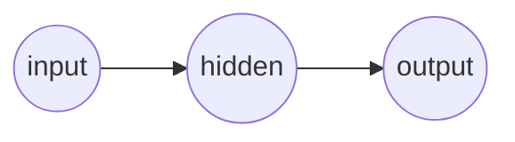

# Multilayer Perceptron (MLP)
## Simplest Possible Deep Learning Neural Network from Scratch

> A Multilayer Perceptron (MLP) is a feed-forward neural network made up of at least three layers input, hidden, and output layer. Deep learning is similarly defined as a neural network with more than two layers (aka possesses 1 or more hidden layers).

### Setup Workspace
1. Install Lua from https://www.lua.org/download.html
2. Execute the below command in this workspace to run the example

```sh
  lua main.lua
```

### Explanation
**TODO...**

<br>
<p align="center">
  <i>Figure 1. Diagram of the Simplest Possible Neural Network</i>
</p>

### Why Lua?
Lua is an extremely basic language, making it very easy to understand, even with a topic like machine learning.
